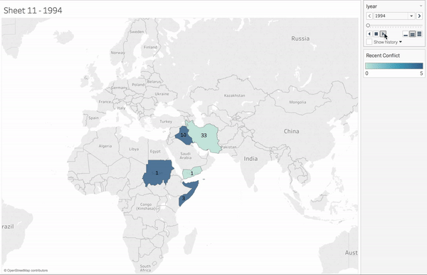

# BrownDatathon

Brown Datathon work. By Sawyer Vaughan, Ryan Louie, James Jang, and Chris Wallace

## Motivation

For the Brown Datathon, we decided to investigate the Global Terrorism Database (GTD). Obviously terrorism is a heavy subject and has been a large focus of our government and politics, especially within the last 15 years and the events of 9/11, the Afghanistan war, the Iraq war, and many of the terror attacks that have occured even within the past year.

We were interested in looking at this data because we feel that it is very important to understand if we want to make a positive change in this space. In addition, with much of the rhetoric in the most recent election campaign revolving around immigration and terrorism, we felt that it was important to challenge assumptions that we make about terrorism and why it happens.

## Work

### Determining Origin

We were interested in investigating the countries that terrorism originates from. To do this, we had to construct data about where attacks originate from. The GTD doesn't include this data, so we needed to determine where attacks originated from. 

First, the GTD includes a field indicating whether the attack was international or not. If the attack was not international, then that is the country of origin of the attack. 

Otherwise, we decided that we would use the group's location as the origin of the attack. Obviously, it is not always correct that attackers are of the nationality of the group's location. However, we decided that it was okay to assume that an attack's origin is the same as the group's location, in order to investigate where the ideas responsible for the terrorism originated.

To determine the group's location, we used the median latitude and longitude of their attacks to determine the country of origin. The assumption that the median latitude and location are in the country of origin holds true if a majority of the group's attacks are in the country that it originates from. To prove this assumption correct, we plotted the amount of international and domestic attacks for each group. There were very few groups in which the number of international attacks was even close to the number of domestic attacks, so this assumption holds true for almost every group. 

This is a plot of the terrorist attacks, color coded by the group responsible for the attack. As you can see, the attacks tend to be largely in the same country as the terrorist group is from.

### Augmenting Data

In order to investigate the factors common in countries with high rates of terrorism, we needed to augment our data with other relevant data about the countries that attacks originate from. We chose the augmented data through a combination of what we believed would be relevant or correlated factors and which data was publicly available. We ended up augmenting our data with the following data about the origin country:

- GNI
- [Polity Score](http://www.systemicpeace.org/polity/polity4.htm)
- Recent Conflicts (Did the country have conflicts within the past 5 years?)

Essentially, we used a left join to append information about the attacker's country of origin.

### Investigating Relationships

We attempted to build a program that would investigate the relationship between the factors surrounding countries where many terrorist attacks originate, in order to build a model that could predict whether a given country is likely to spawn terrorist attacks.

// TODO: Ryan, write about the model here

### Investigating the Travel Ban

On January 27, 2017, President Trump signed Executive Order 13769 into law, restricting entry into the United States for citizens of seven countries. The order blocked entry to citizens from Iran, Iraq, Libya, Somalia, Sudan, Syria, and Yemen, in order to prevent terrorists from these countries from entering the US. We thought it would be interesting to analyze data about terrorism in these countries and examine whether this travel ban might have been effective at improving the security of American citizens, or whether, as commonly said by many opponents of the bill, the bill was discriminatory against Muslims.

Investigating the origin of terror attacks, we found that there was a surprising amount of statistical support for the travel ban. Iraq has the most terror attacks in the world in the past 20 years. Other countries blocked by the travel ban also experience large amounts of terrorist activity. However, some countries that were part of the travel ban weren't as bad as other countries left out in terms of the number of terror attacks carried out by people from those countries. For example, Saudi Arabia experiences a relatively high level of terror attacks, and yet was left out of the bill. You can see a visualization of the amount of terror attacks in the relevant countries below.

Below are two time lapses. The first visual highlights the seven banned countries, while the second includes the entire Middle East. The number represents the number of terror attacks that are originated from the given country. The light blue to dark blue gradient shows how many years the country have been in conflct for past 5 years.

